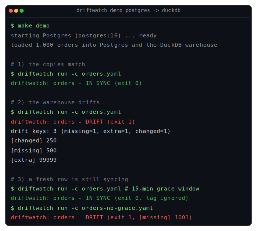
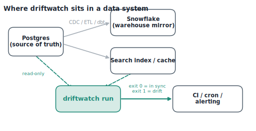
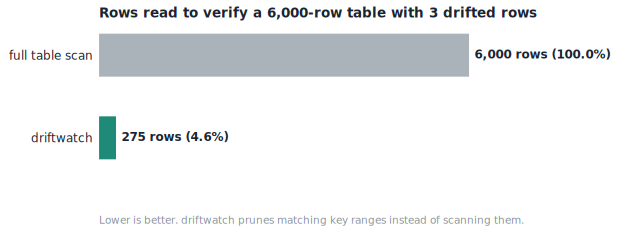
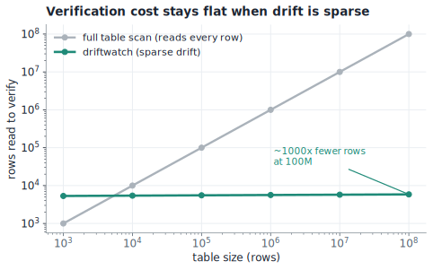
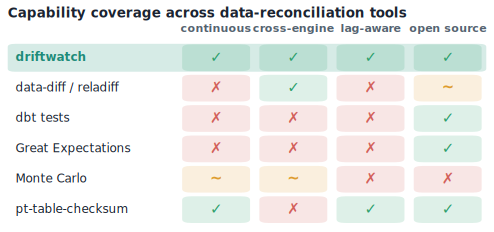

<div align="center">

# driftwatch

**Check that your data copies still match the original, and find out the moment they stop.**

[](LICENSE)
[](https://www.python.org)
[](#development)
[](#status)

<br/>

**Works with**

[](#connectors)
[](#connectors)
[](#connectors)
[](#adding-a-connector)

</div>

---

## What it does

You keep copies of your main database in other places: a data warehouse for analytics, a search
index, a cache, a read replica. Those copies are filled by a sync job, and the sync job goes
wrong sometimes. A row gets dropped, a value gets transformed badly, a delete never lands. Most
of the time nobody notices until a number looks wrong on a dashboard.

driftwatch compares a copy against the original and tells you which rows are different. It knows
the difference between a real problem and a row that is simply still syncing, so it does not wake
you up for normal lag.

It is one command with a clear exit code, so you run it in CI, in cron, or in your data
pipeline, the same way you run a test.

## What you can use it for

- "Did last night's Postgres to Snowflake sync drop any orders?"
- "Does the search index still match the database after a reindex?"
- "After a backfill, did every row land, with the right values?"
- "Before I swap a rebuilt table into production, is it actually correct?"

## See it run

This is a real run against a real Postgres and a real DuckDB warehouse, 1,000 orders loaded into
both. Reproduce it yourself with `make demo` (needs Docker). The script is
[`examples/demo.py`](examples/demo.py) and the full session log is committed at
[`examples/demo-output.txt`](examples/demo-output.txt).

<p align="center"></p>

**The copies match.** All 1,000 rows are verified by reading none of them, because the checksums
agree and the whole range is skipped.

```console
$ driftwatch run -c orders.yaml
driftwatch: orders - IN SYNC
  rows compared: 0   segments scanned: 1   duration: 0.026s
exit code: 0
```

**The warehouse drifts.** One row was dropped, one value was changed, one phantom row was left
behind. driftwatch names all three.

```console
$ driftwatch run -c orders.yaml
driftwatch: orders - DRIFT
  drift keys: 3 total (missing=1, extra=1, changed=1)
  rows compared: 1001   segments scanned: 1   duration: 0.031s
  diverging keys:
    [changed] 250
    [missing] 500
    [extra]   99999
exit code: 1
```

The same run as JSON, for alerting and metrics:

```json
{ "comparison": "orders", "in_sync": false, "drift_total": 3,
  "drift_by_kind": { "missing": 1, "extra": 1, "changed": 1 },
  "drift_keys": [ {"key": [250], "kind": "changed"},
                  {"key": [500], "kind": "missing"},
                  {"key": [99999], "kind": "extra"} ],
  "rows_compared": 1001, "segments_scanned": 1, "duration_seconds": 0.028 }
```

**A fresh row is still syncing.** A new order is in Postgres but has not reached the warehouse
yet. With a 15-minute grace window driftwatch ignores it. Turn the grace window off and the same
row shows up as missing. This is the part a plain diff gets wrong.

```console
$ driftwatch run -c orders.yaml            # 15-minute grace window
driftwatch: orders - IN SYNC               # the not-yet-synced row is ignored
exit code: 0

$ driftwatch run -c orders-no-grace.yaml   # no grace window
driftwatch: orders - DRIFT
  diverging keys:
    [missing] 1001
exit code: 1
```

## Where it fits

driftwatch reads both copies, read-only, and returns an exit code. You put it wherever you
already run jobs.

<p align="center"></p>

## Use it in your stack

**GitHub Actions.** A non-zero exit fails the job, so drift blocks the workflow.

```yaml
- uses: catancs/driftwatch@v0
  with:
    config: driftwatch.yaml
  env:
    PG_DSN: ${{ secrets.PG_DSN }}
    SNOWFLAKE_ACCOUNT: ${{ secrets.SNOWFLAKE_ACCOUNT }}
    SNOWFLAKE_USER: ${{ secrets.SNOWFLAKE_USER }}
    SNOWFLAKE_PASSWORD: ${{ secrets.SNOWFLAKE_PASSWORD }}
```

**Cron.** Run it on a schedule and page someone when it fails.

```cron
*/30 * * * * driftwatch run -c /etc/driftwatch.yaml || /usr/local/bin/page-oncall "orders drift"
```

**Airflow or dbt.** Run it right after the model build so a bad table never goes unverified.

```python
BashOperator(task_id="reconcile_orders",
             bash_command="driftwatch run -c /opt/driftwatch.yaml")
# the task fails when driftwatch exits non-zero, so the DAG surfaces the drift
```

**Promotion gate.** Run it before you swap a staging table into production or serve a rebuilt
index. A non-zero exit stops the promotion.

## Quickstart

**1. Install** it (pick only the connectors you need):

```bash
git clone https://github.com/catancs/driftwatch && cd driftwatch
pip install ".[postgres,snowflake,duckdb]"
```

**2. Scaffold a config:**

```bash
driftwatch init > driftwatch.yaml
```

**3. Point it at your databases.** Set the `source` (your main database) and `target` (the
copy), the `primary_key`, and a `watermark_column` so lag is not mistaken for drift. Credentials
come from the environment through `${VAR}`.

**4. Run it:**

```bash
driftwatch run -c driftwatch.yaml
```

Read the exit code: `0` in sync, `1` drift (the rows are printed), `2` connection or query error,
`3` bad config.

> [!TIP]
> No cloud handy? Run `make demo`, or set both `source` and `target` to `driver: duckdb` with
> local file paths and watch the whole thing work offline.

## Install and run

| You want | Do this |
|---|---|
| pip install (works today) | `pip install "driftwatch[postgres,snowflake,duckdb] @ git+https://github.com/catancs/driftwatch.git"` |
| pip install (after PyPI) | `pip install "driftwatch[postgres,snowflake]"` |
| A container | `docker build -t driftwatch . && docker run --rm -v "$PWD/driftwatch.yaml:/app/driftwatch.yaml" driftwatch run -c driftwatch.yaml` |
| A GitHub Action | `uses: catancs/driftwatch@v0` (see above) |
| Make targets | `make install`, `make test`, `make run`, `make demo` |

## Configuration

One file describes the two databases and what to compare. Secrets are read from the environment.

```yaml
connections:
  source:
    driver: postgres
    dsn: "${PG_DSN}"
  target:
    driver: snowflake
    account: "${SNOWFLAKE_ACCOUNT}"
    user: "${SNOWFLAKE_USER}"
    password: "${SNOWFLAKE_PASSWORD}"
    database: ANALYTICS

comparisons:
  - name: orders
    source_table: public.orders
    target_table: ANALYTICS.PUBLIC.ORDERS
    primary_key: [id]
    watermark_column: updated_at   # only compare rows older than the grace window,
    grace: 15m                      # so warehouse lag is never reported as drift
    compare_columns: "*"            # or an explicit list; exclude_columns also supported
    recheck: { delay: 60s, rounds: 1 }
```

Run one comparison with `--only orders`, or get a JSON report with `--format json`.

## How it works

Two ideas do the work.

**It only reads rows that might be wrong.** Both databases hash ranges of rows and compare just
the hashes. Ranges that match are skipped without reading their rows. driftwatch only looks
closely at the ranges that disagree, so a healthy table is cheap to check and a small problem is
found by reading a tiny fraction of the table. The [benchmark below](#benchmarks-measured)
shows this on real tables up to 10 million rows.

**It tells lag apart from drift.** A plain diff reports every row the copy has not caught up on
yet, which is noise. driftwatch picks a cutoff time at the start of the run and only compares
rows old enough to have synced, then rechecks the suspects a moment later and drops any that have
caught up. It stays quiet until something is actually wrong.

Every run is read-only on both databases, repeatable, and changes nothing. Full design in
[`docs/superpowers/specs/2026-06-20-driftwatch-design.md`](docs/superpowers/specs/2026-06-20-driftwatch-design.md).

## Benchmarks (measured)

These numbers come from a real run on a laptop against a real Postgres and a real DuckDB
warehouse. Reproduce them with `make bench`. The script is
[`examples/benchmark.py`](examples/benchmark.py) and the raw results are committed at
[`examples/benchmark-results.json`](examples/benchmark-results.json).

| table rows | verify a healthy table | rows read | find sparse drift | rows read | found |
|---:|---:|---:|---:|---:|:---:|
| 100,000 | 0.19s | 0 | 0.59s | 2,346 (2.3%) | 7 / 7 |
| 1,000,000 | 1.07s | 0 | 3.28s | 23,440 (2.3%) | 7 / 7 |
| 10,000,000 | 10.8s | 0 | 28.7s | 14,651 (0.15%) | 7 / 7 |

<p align="center"></p>

Two honest takeaways:

- **It reads almost none of the table.** A healthy 10-million-row table is verified by reading 0
  rows. Finding 7 bad rows in 10 million reads about 15,000 (0.15 percent). That is what keeps
  data transfer, memory, and warehouse cost low.
- **It stays correct at scale.** At every size it found exactly the rows that were changed,
  deleted, or added (7 of 7).

<p align="center"></p>

The wall-clock grows with the table because each database hashes its own rows to compute the
checksums. That work happens inside the database and moves no data out. On a cloud warehouse,
where you pay for data scanned and moved, driftwatch moves almost none of it.

## What it catches

| Problem | What you see |
|---|---|
| A sync job dropped a row | `missing` (in the source, not in the copy) |
| A delete never reached the copy | `extra` (in the copy, not in the source) |
| A bad transform changed a value | `changed` (in both, different content) |
| A backfill half ran | a cluster of `missing` rows |
| A schema or encoding change | `changed` rows across the board |

## How it compares

<p align="center"></p>

What is different here:

- **It tells lag apart from drift.** Other diff tools report rows that are simply still syncing.
- **It works across different databases.** Postgres, Snowflake, and DuckDB each compute the same
  row hash in their own SQL, so a Postgres row and its Snowflake copy compare equal by value.
- **It only reads rows that might be wrong**, so checking a healthy table is cheap.
- **New databases are add-on packages**, not changes to the core.

The closest open tool, `data-diff`, is archived and runs once. The continuous one,
`pt-table-checksum`, only works on MySQL. The cross-database continuous one, Monte Carlo, is paid
and runs on a schedule. None of them tells lag apart from drift.

## Connectors

Built-in: `postgres`, `snowflake`, `duckdb` (local stand-in), `memory` (tests). They are
optional extras, so the core stays small, and they load through the `driftwatch.connectors`
entry-point group.

### Adding a connector

Write a class for the six-method `driftwatch.connector.Connector` interface, compute the row hash
from `driftwatch/hashing.py` in your database's SQL, and register it as a separate package:

```toml
[project.entry-points."driftwatch.connectors"]
clickhouse = "driftwatch_clickhouse:ClickHouseConnector"
```

The test in `tests/test_duckdb_connector.py`, which checks that your hashes match the reference
implementation on the same data, is the bar every connector has to clear.

## Credit: built on Kleppmann's "trust, but verify"

driftwatch implements an idea from Martin Kleppmann's
[*Designing Data-Intensive Applications*](https://dataintensive.net) (2nd edition, 2026, written
with Chris Riccomini). The last chapter, "Aiming for Correctness," argues that a mature data
system should not assume its derived data is correct and should keep checking. Kleppmann calls
this "trust, but verify."

There was no good open-source tool for this in the world of warehouses and sync pipelines, so
teams write a one-off reconciliation script every time. driftwatch is that tool, built on his
idea. The idea is Kleppmann and Riccomini's. The code is ours.

## Development

```bash
pip install ".[dev,duckdb]" && pytest -q     # 62 passing, 3 skipped (gated live databases)
```

The suite runs offline against DuckDB. Postgres conformance runs against a service container,
and Snowflake tests are gated on credentials. The figures come from
[`docs/render_figures.py`](docs/render_figures.py) (`make figures`). A CI workflow is in
[`docs/ci-workflow.yml`](docs/ci-workflow.yml); move it to `.github/workflows/ci.yml` to turn it
on (that path needs a token with the `workflow` scope).

## Status

Alpha. The engine, the connectors, and the CLI are tested and working. The always-on watcher, a
Prometheus metrics endpoint, and PyPI and Homebrew releases are next. Issues and new connectors
are welcome.

## License

[Apache-2.0](LICENSE).
